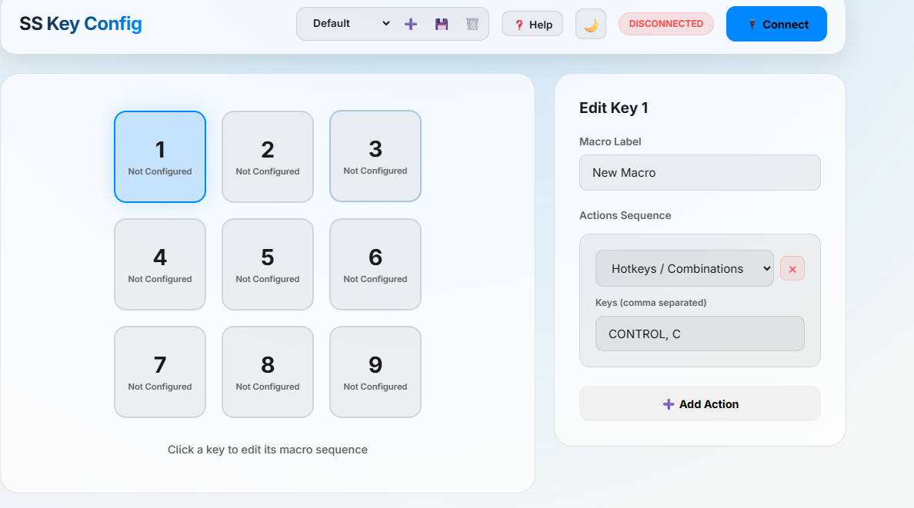
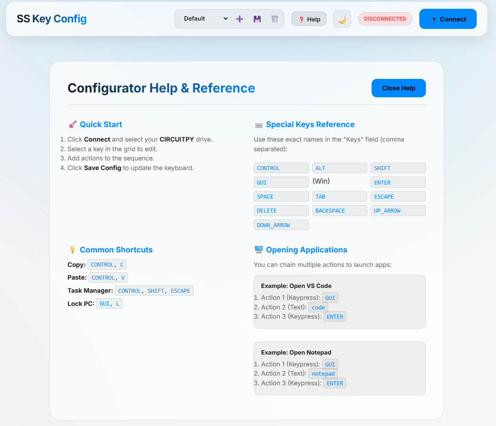
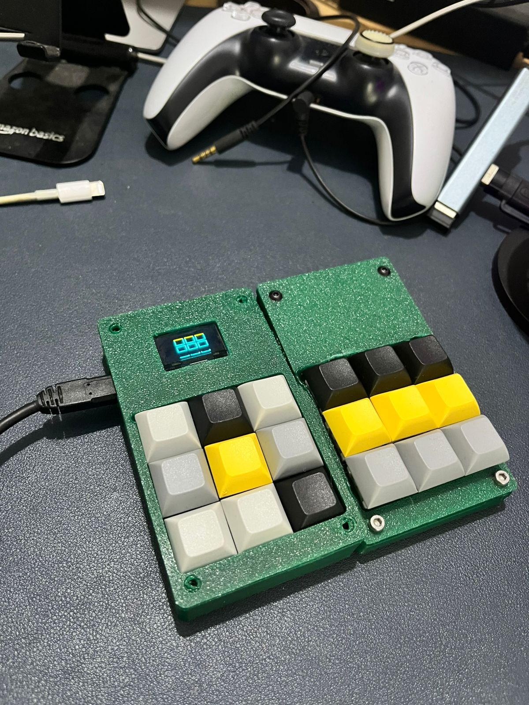
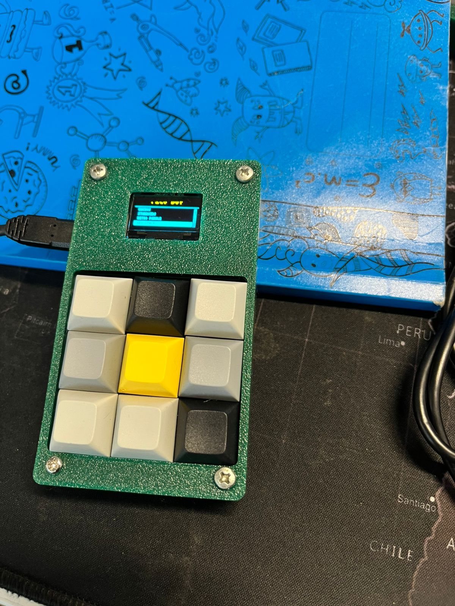

# ⌨️ RP2040 Macro Keyboard

A professional, open-source 3x3 macro keyboard project featuring an RP2040-based firmware and a modern web-based configurator.

## 📸 Project Gallery

### 🖥️ Web Configurator
| Main Interface | Help & Reference |
|:---:|:---:|
|  |  |

### 🔌 Hardware & PCB
| PCB Front | PCB Back | Assembly View |
|:---:|:---:|:---:|
|  |  |  |

### 🛠️ Working Prototype
| Side View | Top View | Gameplay Demo |
|:---:|:---:|:---:|
|  |  | [🎥 Gameplay Demo](pcb/gameplay_demo.mp4)   [🎥 Early Prototype](pcb/prototype_v1_demo.mp4) |

### 📸 Assembly Gallery
| Final Build | Internal Wiring | Complete Unit |
|:---:|:---:|:---:|
|  |  |  |

---

## 🛒 Purchase Official Prebuilt Kit (Amazon.in)
Don't want to source parts and solder it yourself? You can buy a fully assembled, tested, and ready-to-use **SS Macro Keyboard** on Amazon India.

*   **Premium Build**: High-quality mechanical switches and custom PCB.
*   **Plug & Play**: Comes pre-flashed with the latest firmware.
*   **Official Support**: Buyers of the prebuilt kit receive priority technical support.

[**👉 Buy on Amazon.in (Coming Soon)**](https://www.amazon.in/dp/YOUR_PRODUCT_ID)

---

## 🚀 Features

- **Web-Based Configurator**: Remap keys directly from your browser using the File System Access API. No software installation required!
- **Multi-Action Macros**: Each key can trigger a sequence of actions including hotkeys, text strings, and media controls.
- **Profile Management**: Save and switch between different macro profiles.
- **Dark Mode Support**: Sleek, modern UI with theme persistence.
- **Simple Firmware**: Lightweight CircuitPython firmware that runs on any RP2040 board.

## 🛠️ Hardware Requirements

- **Microcontroller**: Any RP2040-based board (e.g., Raspberry Pi Pico, Adafruit KB2040, Seeed Studio XIAO RP2040).
- **Matrix**: 3x3 mechanical switch matrix (or any configuration, adjustable in `firmware/code.py`).
- **Connection**: USB-C/Micro-USB cable.
- **PCB**: Custom designed PCB (files in `pcb/` folder). [View Schematic](pcb/Schematic_MacroKeyboard_2026-05-12.png)

## 💾 Installation

### 1. Firmware Setup
1. Install **CircuitPython** on your RP2040 board.
2. Copy the contents of the `firmware/` folder to your board's root directory (`CIRCUITPY` drive).
3. Ensure you have the necessary libraries in the `lib/` folder (standard Adafruit HID libraries).

### 2. Configurator Setup
If you want to host your own configurator:
1. Navigate to the `configurator/` directory.
2. Install dependencies: `npm install`
3. Run locally: `npm run dev`
4. Build for production: `npm run build`

## ⚙️ Usage Guide

1. Connect your macro keyboard via USB.
2. Open the [Macro Keyboard Configurator](https://sathishrazor.github.io/mackro-keyz/) in a modern browser (Chrome, Edge, or Opera).
3. Click **Connect** and select the `CIRCUITPY` drive.
4. Select a key in the grid, add your macro actions, and click **Save Config**.
5. Your keyboard will immediately reflect the changes!

## 📜 License

This project is licensed under the MIT License - see the [LICENSE](LICENSE) file for details.

## 🙌 Contributing

Contributions are welcome! Feel free to open issues or submit pull requests to improve the firmware or the configurator.

## 📞 Support

- **For DIY Users**: Please open a [GitHub Issue](https://github.com/sathishrazor/mackro-keyz/issues) for community support.
- **For Amazon Buyers**: Please contact us via the Amazon Messaging System for priority support and warranty claims.

## ⚖️ Legal Disclaimer

*   **Trademarks**: "RP2040" is a trademark of Raspberry Pi Ltd. "CircuitPython" is a trademark of Adafruit Industries.
*   **Safety**: This is a DIY hardware project. While the prebuilt kit is tested, use it at your own risk. The authors are not responsible for any damage to your computer or hardware.
*   **Software**: The configurator uses the [Web Serial / File System API](https://developer.mozilla.org/en-US/docs/Web/API/File_System_API) which is currently supported in Chromium-based browsers (Chrome, Edge, Opera).
