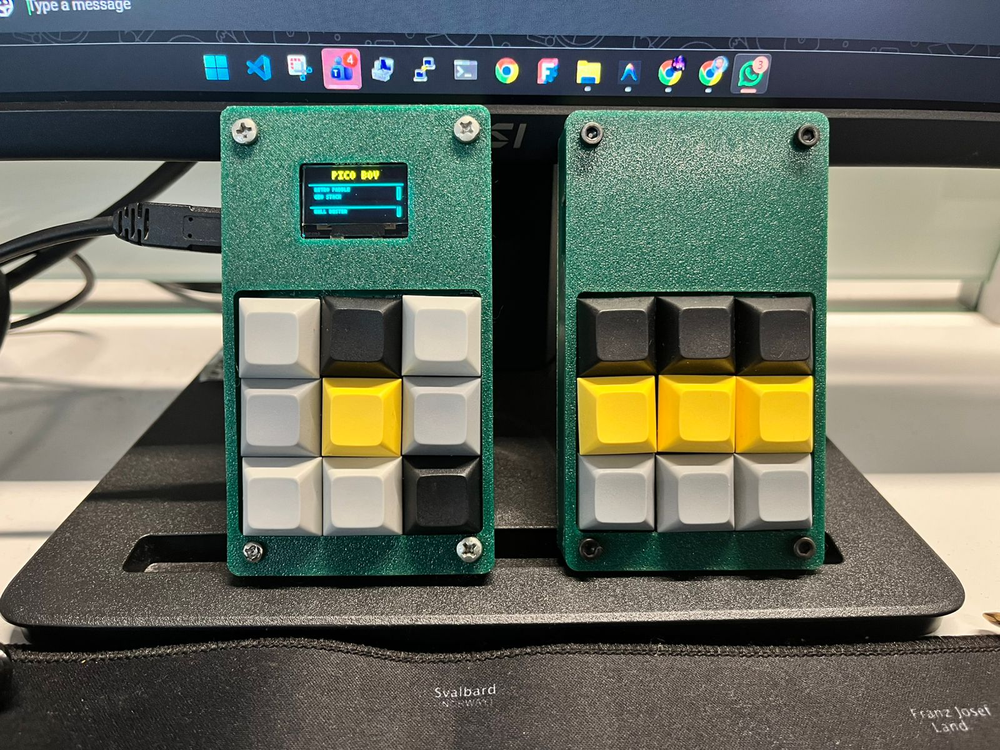
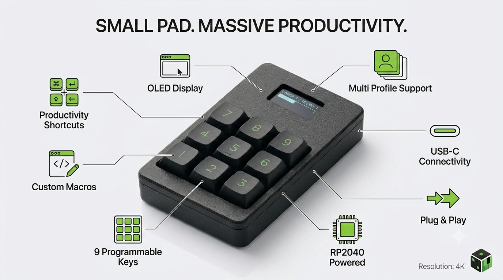

# ⌨️ Dice and Layers Macro Keyboard

A professional, open-source 3x3 macro keyboard kit sold as **Dice and Layers** via Amazon India and Shopify. This repository includes RP2040 firmware, a web-based configurator, and PCB design files.

## 📸 Project Gallery

### 🖥️ Web Configurator
| Main Interface | Help & Reference |
|:---:|:---:|
|  |  |

### 🔌 Hardware & PCB
| Product Preview | Prototype | Assembly View |
|:---:|:---:|:---:|
|  |  |  |

### 🛠️ Working Prototype
| Product Demo | Config Steps | Feature Preview |
|:---:|:---:|:---:|
| [🎥 Gameplay Demo](pcb/gameplay_demo.mp4) |  |  |

### 📸 Assembly Gallery
| Final Build | Internal Wiring | Complete Unit |
|:---:|:---:|:---:|
|  |  |  |

---

## 🛒 Buy Dice and Layers Kits
Official kits are available on Amazon India and Shopify.

- **Amazon India**: [https://amzn.in/d/03T7fW42](https://amzn.in/d/03T7fW42)
- **Shopify store**: [https://aivian.in](https://aivian.in)
- **Store name**: Dice and Layers

If you want a ready-to-use kit instead of building from scratch, these are the easiest purchase options.

---

## 🔗 Follow Dice and Layers
- Instagram: [https://www.instagram.com/diceandlayer/](https://www.instagram.com/diceandlayer/)
- YouTube: [https://www.youtube.com/@diceandlayers](https://www.youtube.com/@diceandlayers)

---

## 🚀 Features

- **Web-Based Configurator**: Remap keys directly from your browser using the File System Access API. Configures both 3x3 and 1x3 layouts.
- **Dynamic Board Support**: Supports both the standard 3x3 matrix layout and the 1x3 direct-pin layout.
- **Visual Feedback**: Supports a 1x3 layout with 3 status LEDs and an onboard NeoPixel RGB LED.
- **Multi-Action Macros**: Each key can trigger sequences like hotkeys, text strings, and media controls.
- **Profile Management**: Save and switch between different macro profiles.
- **Lightweight Firmware**: CircuitPython-based firmware for RP2040 boards.

## 🛠️ Hardware Requirements

- **Microcontroller**: Any RP2040 board (e.g., Raspberry Pi Pico, Adafruit KB2040).
- **Supported Layouts**:
  - **3x3 Matrix**: 3x3 mechanical switch matrix with optional SSD1306 OLED.
  - **1x3 Direct**: 3 keyed switches, 3 status LEDs, and a NeoPixel.
- **Connection**: USB cable.
- **PCB**: Custom board files are in the `pcb/` folder. [View Schematic](pcb/Schematic_MacroKeyboard_2026-05-12.png)

## 💾 Installation

### 1. Firmware Setup
1. Install **CircuitPython** on your RP2040 board.
2. Copy the contents of `firmware/` to the board's root `CIRCUITPY` drive.
3. Make sure the `lib/` folder contains the required Adafruit HID libraries.

### 2. Configurator Setup
1. Open `configurator/`.
2. Install dependencies: `npm install`
3. Run locally: `npm run dev`
4. Build for production: `npm run build`

## ⚙️ Usage Guide

1. Connect the keyboard via USB.
2. Open the [Macro Keyboard Configurator](https://sathishrazor.github.io/mackro-keyz/) in a Chromium browser.
3. Click **Connect** and select the `CIRCUITPY` drive.
4. Pick a key, add macro actions, and click **Save Config**.
5. The keyboard will update immediately.

## 📜 License

This project is licensed under the MIT License. See [LICENSE](LICENSE) for details.

## 🙌 Contributing

Contributions are welcome. Open issues or submit pull requests to improve the firmware or configurator.

## 📞 Support

- **DIY Users**: Open a [GitHub Issue](https://github.com/sathishrazor/mackro-keyz/issues).
- **Amazon Buyers**: Use Amazon Messaging for support and warranty help.

## ⚖️ Legal Disclaimer

* **Trademarks**: RP2040 is a Raspberry Pi trademark. CircuitPython is an Adafruit trademark.
* **Safety**: This is DIY hardware. Use at your own risk.
* **Software**: Configurator uses the [File System API](https://developer.mozilla.org/en-US/docs/Web/API/File_System_API), supported by Chromium-based browsers.
